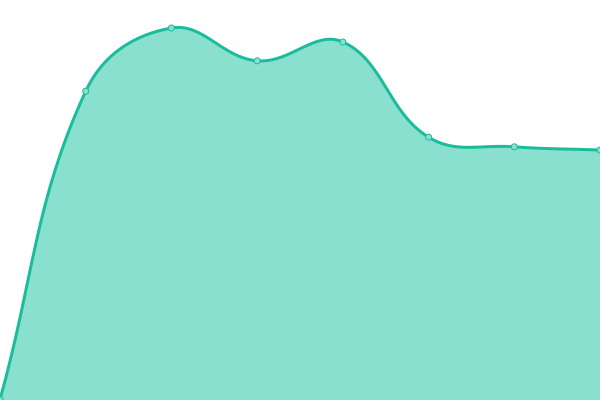
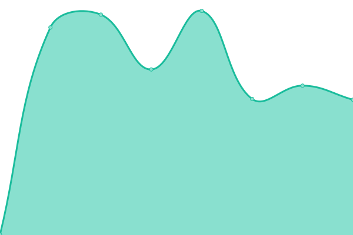
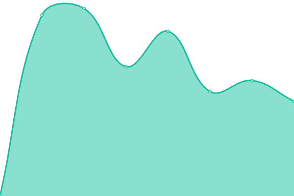
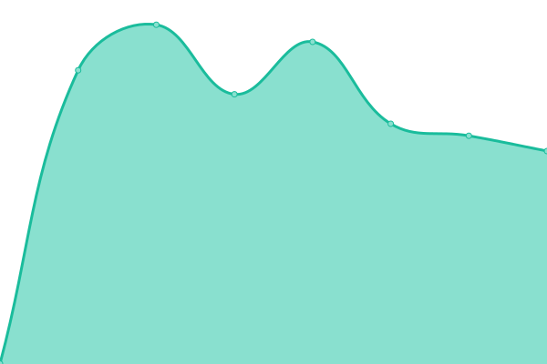

# [📈 Live Status](https://upptime.github.io/upptime): <!--live status--> **🟩 All systems operational**

This repository contains the open-source uptime monitor and status page for [Upptime](https://upptime.js.org), powered by [Upptime](https://github.com/upptime/upptime).

With [Upptime](https://upptime.js.org), you can get your own unlimited and free uptime monitor and status page, powered entirely by a GitHub repository. We use [Issues](https://github.com/upptime/upptime/issues) as incident reports, [Actions](https://github.com/brainsys/upptime/actions) as uptime monitors, and [Pages](https://upptime.github.io/upptime) for the status page.

<!--start: status pages-->
<!-- This summary is generated by Upptime (https://github.com/upptime/upptime) -->
<!-- Do not edit this manually, your changes will be overwritten -->
<!-- prettier-ignore -->
| URL | Status | History | Response Time | Uptime |
| --- | ------ | ------- | ------------- | ------ |
|  [BrainServerOne-V1](https://v1.brainsys.co.uk) | 🟩 Up | [brain-server-one-v1.yml](https://github.com/brainsys/upptime/commits/HEAD/history/brain-server-one-v1.yml) | 

 798ms
     
 | 

<a href="https://status.brainsys.com/history/brain-server-one-v1">100.00%</a>
    

|  [BrainServerThree-V3](https://v3.brainsys.co.uk) | 🟩 Up | [brain-server-three-v3.yml](https://github.com/brainsys/upptime/commits/HEAD/history/brain-server-three-v3.yml) | 

 745ms
     
 | 

<a href="https://status.brainsys.com/history/brain-server-three-v3">100.00%</a>
    

|  [BrainServerFour-V4](https://v4.brainsys.co.uk) | 🟩 Up | [brain-server-four-v4.yml](https://github.com/brainsys/upptime/commits/HEAD/history/brain-server-four-v4.yml) | 

 754ms
     
 | 

<a href="https://status.brainsys.com/history/brain-server-four-v4">100.00%</a>
    

|  [BrainServerSix-V6](http://v6.brainsys.co.uk) | 🟩 Up | [brain-server-six-v6.yml](https://github.com/brainsys/upptime/commits/HEAD/history/brain-server-six-v6.yml) | 

 586ms
     
 | 

<a href="https://status.brainsys.com/history/brain-server-six-v6">100.00%</a>
    

|  [BrainServerSeven-V7](https://v7.brainsys.co.uk) | 🟩 Up | [brain-server-seven-v7.yml](https://github.com/brainsys/upptime/commits/HEAD/history/brain-server-seven-v7.yml) | 

 774ms
     
 | 

<a href="https://status.brainsys.com/history/brain-server-seven-v7">100.00%</a>
    

<!--end: status pages-->

[**Visit our status website →**](https://upptime.github.io/upptime)

## 📄 License

- Powered by: [Upptime](https://github.com/upptime/upptime)
- Code: [MIT](./LICENSE) © [Upptime](https://upptime.js.org)
- Data in the `./history` directory: [Open Database License](https://opendatacommons.org/licenses/odbl/1-0/)
